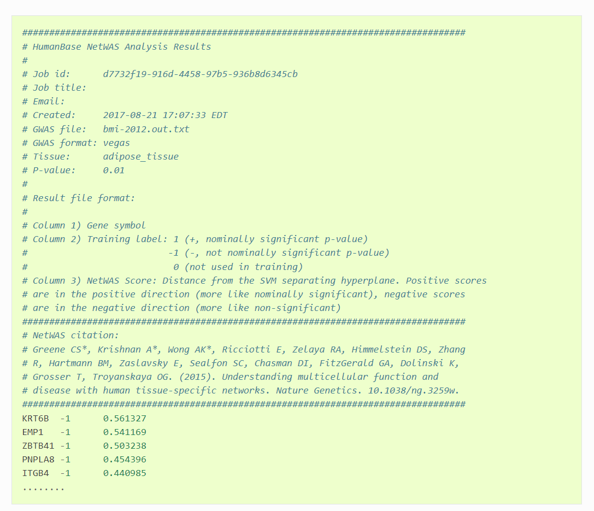

# NetWAS - network-wide association study

The following scripts are used to process the results produced by NetWAS:
1. parse_netwas_results.py
2. convert_gene_id_ensembl_id.R

The results of NetWAS need to be processed before they can be used for analysis. First of all NetWAS adds a header to the output files, as can be seen [here](#example-output-netwas), this header needs to removed to be able to analyse the data. This can be done using the [`parse_netwas_results.py`](parse_netwas_results.py) script, optionally it can also be used to filter out the gene symbols. 

To check how the python script works you can look at the help function:

```bash
python3 parse_netwas_results.py -h
```

The next step is to convert the gene symbols into ensembl gene IDs. This is necessary in order to compare the results of NetWAS with HPO data because it only contains ensembl gene IDs and no gene symbols. An R script was written to convert the gene symbols of the NetWAS results into ensembl gene IDs, nameley [convert_gene_id_ensembl_id.R](convert_gene_id_ensembl_id.R).

This R script requires a configuration file to be present in the same directory with the name: [config.yml](config.yml)

Example:

```yaml
default:
  traits:
    height: "path/to/height/data.txt"
    PrC: "path/to/prostate_cancer/data.txt"
    IBD: "path/to/IBD/data.txt"
  output_folder: "output/folder/"
```

Inside the tratis section are all the results of NetWAS sepcified for different traits. The `output_folder` specifies where the resulting files should be saved. 

## Example output NetWAS

<div align="center">
  <a href="https://humanbase.readthedocs.io/en/latest/netwas.html">
    
  </a>
</div>


